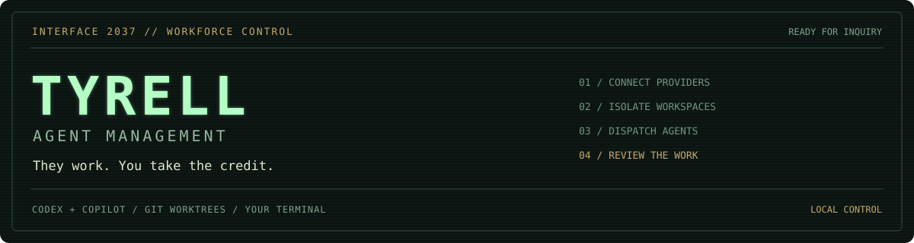
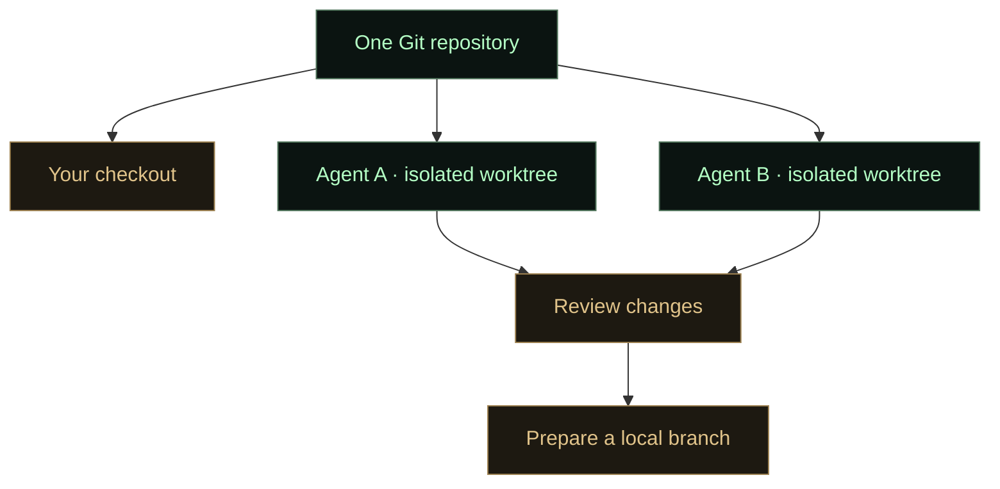

<p align="center">
  
</p>

# Tyrell Agent Management

**Independent coding agents. Isolated workspaces. One terminal.**

Tyrell brings **Codex** and **GitHub Copilot** agents together in a local terminal
app. Each agent has its own conversation, model, plan and working folder, so you
can run several tasks side by side and review their results in one place.

Follow progress in **Plan**, review changes in **Files**, and inspect commands and
running processes without filling the conversation with tool output. Agents can
also hand work and context to a new agent using another provider.

## Get started

Once the first release is available, install with Homebrew:

```sh
brew tap micke232/tyrell-agent-management https://github.com/micke232/tyrell-agent-management.git
brew install tyrell
```

Install **Codex CLI**, **GitHub Copilot CLI**, or both separately. Each provider
needs its own account and sign-in. Tyrell's setup guides you through the connections:

```sh
tyrell setup
tyrell
```

Create an agent, choose its provider and model, then select a project folder in
**Setup**. Review its instructions and access settings, and send a task to begin.
You can also use an agent without a repository.

Try `tyrell demo` to explore the interface without connecting a provider.
See the [installation guide](docs/install.md) for provider setup and alternatives
to Homebrew. Keyboard and navigation help is available inside the app.

## Work in parallel with Git worktrees

A worktree gives an agent its own working directory within the same Git repository.
Your normal checkout stays on its current branch while agents work independently
on features, fixes or investigations.



1. Choose a Git repository in **Setup** and leave **Isolated worktree** enabled.
2. Select a **Base branch** and send the agent its task. The first message creates
   its worktree; later messages reuse it.
3. Review the result in **Files**. Changes remain visible after the agent commits them.
4. When ready, choose **Local review branch → Prepare local branch…** and wait for
   the agent to confirm the branch and commit. You can then check it out locally.

Each worktree starts from a committed base. Your normal checkout's uncommitted
changes are left in place, and agents can start from different branches. Worktrees
share Git history, but have separate working files; they are not security sandboxes.

You choose the final branch name when the work is ready. Preparing it does not
push or merge automatically. Closing the app or archiving an agent keeps its
worktree on disk.

## Make it fit your project

**Setup** controls how an agent works: model preferences, project instructions,
quality checks, permissions and development servers. It can import package scripts
and applicable `AGENTS.md` guidance from a folder. Separate agent ports help avoid
collisions with your own development server.

**Settings** manages provider connections, terminal options and interface colors.
Closing the dashboard leaves the local background service running; reopen `tyrell`
to reconnect to your agents.

Tyrell is currently a preview. **macOS with Ghostty** is the primary tested setup;
Linux is experimental, and terminal support for mouse and clipboard features varies.

[Installation and troubleshooting](docs/install.md) · [Agent setup](docs/agent-setup.md)
