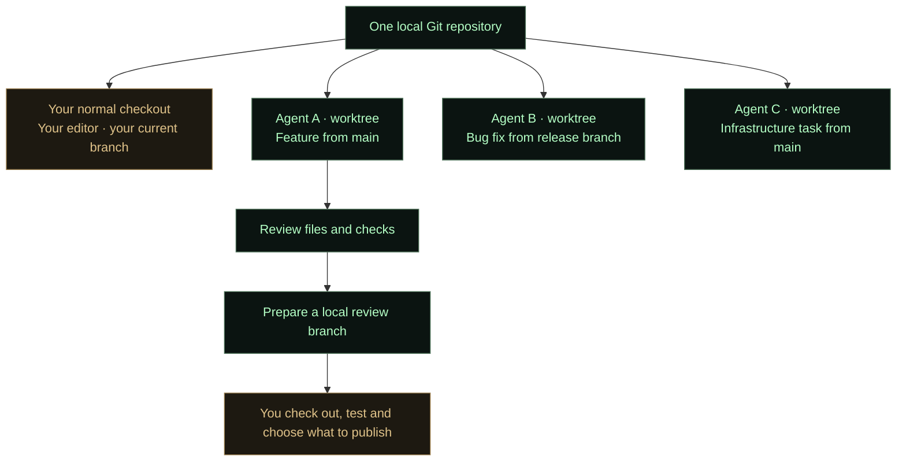

<p align="center">
  
</p>

# Tyrell Agent Management

**Run independent coding agents in parallel, give each one its own workspace, and review their work from one terminal.**

Tyrell is a local terminal application for managing **Codex** and **GitHub Copilot**
agents. Each agent has its own conversation, model, plan, settings and working
folder. You can let one agent investigate a bug, another build a feature, and a
third work on infrastructure without constantly changing branches in your editor.

The key is **Git worktrees**: agents can work on separate copies of the same
repository while your normal checkout stays on its current branch. When an agent
finishes, review its changes and ask it to prepare a local branch you can check out.
You decide what to keep, merge or publish.

> **Preview software.** macOS is the verified platform; Linux is experimental.
> Ghostty is the primary terminal used for the interface. Other terminals can work,
> but mouse, clipboard and keyboard support differ. Native Windows is unsupported.

[Get started](#get-started) · [Worktree workflow](#worktree-workflow) ·
[Controls](#controls) · [Agent setup](#configure-how-an-agent-works) ·
[Installation details](docs/install.md) · [Releases](docs/homebrew.md)

## What Tyrell does

| Capability | What it helps you do |
| --- | --- |
| Independent agents | Keep conversations and work contexts separate; choose Codex or Copilot per agent. |
| Isolated workspaces | Work on different tasks and base branches in the same repository simultaneously. |
| Plans and progress | Follow a checklist in **Plan** while keeping the conversation readable. |
| File changes | Browse changed files and diffs in **Files** without searching through tool output. |
| Tools and processes | Inspect commands, logs, workspace-related processes and listening ports separately. |
| Project-aware setup | Import package scripts and project guidance, including applicable `AGENTS.md` files. |
| Access controls | Choose how much access an agent gets and when it needs approval. |
| Provider handoff | Pass work and a summary to a new agent, including one using the other provider. |
| Persistent work | Close the dashboard view and return later while the background service keeps running. |

Tyrell coordinates installed provider CLIs; it is not a model or a replacement for
your provider account. Provider availability, models and organizational policies
still apply. It does not automatically merge work or publish your branches.

## Get started

### 1. Install Tyrell

Once the first GitHub release is published, add this repository as a Homebrew source
**once**, then install:

```sh
brew tap micke232/tyrell-agent-management https://github.com/micke232/tyrell-agent-management.git
brew install tyrell
```

The repository contains both the app and its Homebrew formula. After the initial
`tap`, the installation and upgrade commands do not need a GitHub username:

```sh
brew upgrade tyrell
```

Homebrew installs the required Python and Git dependencies. Ghostty is optional
and is only installed if you choose it during terminal setup. For installation
without Homebrew, use a release wheel as described in the [installation guide](docs/install.md).
The Homebrew URL will not resolve until the corresponding release is published.

### 2. Connect a provider

Install and sign in to **Codex CLI**, **GitHub Copilot CLI**, or both using their
[official installation instructions](docs/install.md#codex).
These are separate from installing Tyrell and require an account with access.

```sh
tyrell setup
tyrell login codex
# Or:
tyrell login copilot
```

For Copilot on your organization's GitHub Enterprise host:

```sh
tyrell login copilot --host https://company.ghe.com
```

Open **F10 Settings** to see connections, provider setup, terminal settings,
interface colors and the option to keep your Mac awake while agents are active.
Provider login is separate from signing in to `gh` for GitHub repository operations.

### 3. Create your first agent

```sh
tyrell
```

The startup display waits for a key before opening the dashboard.

1. Press **F3** and choose an agent name and provider/model.
2. Open **Setup → This agent / task → Choose folder…**.
3. Browse to a project folder and choose **OK · Use this folder**.
4. Review the imported commands, project instructions and access settings.
5. For a Git repository, keep **Isolated worktree** enabled and choose a **Base branch**.
6. Return to **Chat**, describe the task in **Prompt**, and press Enter.

Creating an agent or choosing a folder does not start work. The first message
starts the task. You can also create an agent without a repository for a general
conversation, then choose a project later while the agent is ready.

Try `tyrell demo` to explore the interface without a connected provider.

## Worktree workflow

### What is a worktree?

A Git worktree is another working directory attached to the **same local Git
repository**. It shares Git history and branch references, but has its own checked-out
files. Your editor can stay in your normal project folder while agents edit files
in their own directories.



### Start two tasks in the same project

For example, create **Checkout UI** and **Infra cleanup** using F3. Choose the
same repository for both agents, but give each its own task and Setup preferences.
Select `main` for one and another existing branch for the other if needed.

With **Setup → Git worktree → Isolated worktree** enabled:

- The **first message** creates that agent's worktree from the selected committed
  base. The base list puts `main` first; an empty base means the repository's current HEAD.
- Later messages reuse the same worktree and conversation.
- Worktrees created through this flow initially use **detached HEAD**. That means
  there is a checked-out commit, but no final branch name to choose yet.
- Your normal checkout keeps its branch and uncommitted changes. Those uncommitted
  changes are **not copied** into a newly created worktree.
- Each agent retains its own base commit, working folder, plan and settings.

There is no Jira-number requirement for a temporary worktree. Choose a final branch
name when the result is ready. Once an agent has a worktree, create another agent
if you need a different project or base; existing work is preserved.

**Isolation here means separate working files, not a security sandbox.** Git
history and branch references are shared. Choose appropriate access settings and
review what the agent is allowed to run. Dependencies, local `.env` files and dev
servers are not automatically cloned from your usual checkout.

### Check what the agent changed

The header shows the working folder and branch/worktree context. Use:

- **Plan** for completed and remaining steps.
- **Files** for the changed-file tree and diffs. In an isolated worktree, changes
  are compared with its starting commit, so committed task changes remain visible.
- **Tools** for commands and their output.
- **Processes** for local processes and ports associated with workspaces.

Opening another folder in **Files** changes only the browser's root, not the
agent's working folder. Use **Use agent workspace** to return to the agent's files.

### Turn the result into a branch you can review

When the agent is ready:

1. Review the result and any remaining checks.
2. In **Setup → Git worktree**, set **Local review branch**, for example
   `feature/checkout-accessibility`.
3. Choose **Prepare local branch…**.
4. Wait for the agent to report the actual branch, commit and checks performed.

This sends an instruction to the agent to review and commit its intended changes
in the worktree, create the requested local branch, and leave the worktree detached
so the branch can be checked out elsewhere. It is an agent task, not an immediate
Git operation completed by the button. Existing branches are not overwritten.

Back in your normal repository, with your own local work safely committed or stashed:

```sh
git switch feature/checkout-accessibility
git diff main...HEAD
# Run your normal local checks and review the result.
```

The branch already belongs to the shared repository; there is no folder-copy step.
Push it and open a pull request when you are satisfied. Tyrell's preparation step
does **not** push, open a PR or merge automatically.

### Worktree lifecycle

Closing the dashboard, hiding an agent or archiving a conversation does not delete
its worktree. Your work remains on disk. Worktrees are stored under the selected
Tyrell data directory, normally `~/.tyrell/worktrees/` for new installations.

Use `git worktree list` in the original repository to inspect them. Only remove a
worktree after its agent has stopped and you have preserved the work you want.
Folders without Git can still be used, but they do not get Git worktree isolation.

## Configure how an agent works

**Setup belongs to the agent or project. F10 Settings belongs to the application.**

Setup can save preferences for one agent, a project profile or shared defaults.
Importing a folder detects Git, `package.json` scripts and project conventions
without running scripts or installing dependencies.

| Setup area | Typical choices |
| --- | --- |
| Model and response | Provider/model, supported reasoning preferences, response length and task context. |
| Project context | Working folder, package scripts, documentation links and applicable agent instructions. |
| Quality checks | Lint and type checking; whether to run or create tests, including end-to-end checks. |
| Runtime and ports | Whether the agent may start a dev server and which commands and ports to use. |
| Infrastructure | Terraform-related formatting, validation and optional planning preferences. |
| Access | Provider-specific file, network and approval settings. |
| Git worktree | Isolation, base branch and preparation of a local review branch. |

Tyrell imports applicable `AGENTS.md` guidance, including parent directories and
`AGENTS.override.md` precedence within a directory. Recognized conflicts with Setup
are highlighted in the instruction preview. This is a limited rule check; the
agent must still read and follow current project instructions.

For independent development servers, agents receive ports in **42000–42999**,
avoiding configured developer ports and detected listeners. Allocation does not
reserve a socket: the agent must recheck before starting a server. A **Workspace
match** in Processes identifies the folder, not proof of which agent launched it.

### Permissions and waiting

For Codex, Setup offers read-only, workspace and full-access configurations plus
approval policy. **Autonomous / full access** selects full access and no routine
approval prompts. Copilot has its own **Ask** and **Autonomous** controls and remains
subject to the provider and organization's policy.

Access changes take effect on the next new turn. They do not alter a tool already
running or automatically answer a pending request. Open **Waiting** or `/requests`
to inspect a question or approval. `/interrupt` stops the selected agent's current turn.

## Keep work moving

Write a follow-up message to steer an active agent or add context. The agent is
instructed to update its plan and retain unfinished tasks. Plans appear in **Plan**,
not as repeated checklists in Chat. Progress and estimated time depend on what the
provider reports; Tyrell does not invent completion percentages.

For a provider handoff, use **F6**. The source agent must be ready. Tyrell prepares a
new agent with a recent conversation summary, plan and an isolated worktree with
transferable changes. Ignored dependencies and known credential files are excluded;
omissions are reported. The new agent starts when you send it a message.

Closing the view leaves the background service running. Reopen `tyrell` to reconnect.
This is local persistence, not an always-on cloud service: sleep, logout or shutdown
can interrupt work. **Keep Mac awake** prevents idle system sleep while agents are
active or waiting; the display may still turn off. `tyrell stop` stops the service
when all agents are idle.

## Controls

| Key | Action |
| --- | --- |
| **Tab** | Move focus between agents, history and Prompt. |
| **F1** | Help. |
| **F2** | Tabs; use Left/Right while the tab strip is focused. |
| **F3** | Create an agent. |
| **F4** | Browse archived agents. |
| **F5** | Rename the selected agent. |
| **F6** | Hand work to a new agent. |
| **F10** | Application settings and connections. |
| **Esc** | Close an overlay or return to Chat. |
| **Enter** | Send the prompt. |
| **Shift+Enter / Alt+Enter** | New line, depending on terminal support. |
| **Ctrl+Q** | Close the view; background work continues. |

Click agents and tabs, scroll history with the mouse, and drag over chat text to
select it. Clipboard behavior depends on the terminal; see the [clipboard guide](docs/install.md#apple-terminal-clipboard).
On macOS, function keys may require **Fn**. The UI is English; conversations can use
any language. Agent dots are **blue: Working**, **green: Ready**, **yellow: Waiting**.

## Your data and provider connections

New installations store local settings and workspace metadata in `~/.tyrell`.
Existing installations with `~/.codex-dashboard` keep using that directory so
history, settings and worktree paths remain valid. `TYRELL_HOME` or `--state-dir`
selects a custom location; the older environment variable remains supported.
Provider CLIs manage their own authentication and session storage.

Tyrell is independent of any particular company, account or project. Installing it
does not provide someone else's credentials, provider subscription or repository
access. Share the release package, not your personal data directory.

## Develop and release

The implementation lives in [`tyrell/`](tyrell/). It uses Python's standard library
at runtime. Build tools are installed separately:

```sh
git clone https://github.com/micke232/tyrell-agent-management.git
cd tyrell-agent-management
python3.14 -m venv .venv
.venv/bin/python -m pip install -r packaging/build-requirements.txt
.venv/bin/python -m tyrell demo
.venv/bin/python -B -m unittest discover -s tests
```

Use feature branches and pull requests into `main`. Before committing changes to
packaged code or the installation guide, regenerate the formula:

```sh
.venv/bin/python scripts/prepare_release.py
```

One GitHub Actions workflow runs tests, verifies the formula checksum, installs the
wheel in a clean environment and exercises the Homebrew installer. Version tags
from `main` create tested **release drafts**. Publishing the release activates the
formula already included in that PR; no second formula PR is necessary.
See [the release guide](docs/homebrew.md) for the full sequence.

For further details: [installation and troubleshooting](docs/install.md),
[agent Setup](docs/agent-setup.md), and [the detailed interface reference, in Swedish](docs/reference.md).
